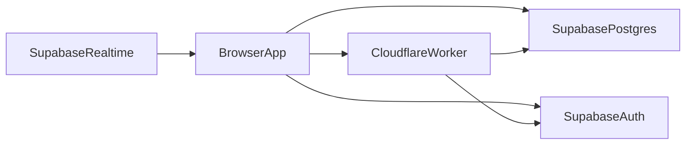

# Arquitetura ? ViaX Urban Pulse Exchange

## Stack

- Frontend: React 19 + TanStack Router/Start + TanStack Query + Tailwind + Radix
- Backend app: Cloudflare Worker (`src/server.ts`) com SSR e handlers `/api/*`
- Dados: Supabase Postgres + Auth + Realtime + RPC + pg_cron

## Fluxos principais

1. **Leitura p?blica de mercados**: `useMarkets` -> `supabase.from("markets")` -> React Query cache.
2. **Leituras cr?ticas autenticadas**: hooks chamam ServerFns BFF (`src/actions/account.ts`) -> Supabase/RPC.
3. **Aposta**: `placeBetFn` (serverFn) -> RPC `place_bet` -> invalida??o de queries.
4. **Realtime**: `useSupabaseRealtime` atualiza cache (`markets`, `feed`, `notifications`).
5. **Futebol cron**: `scheduled` no Worker chama `runFootballSync`/`runFootballResolve`.
6. **Resolu??o urbana**: `pg_cron` chama `tick_market_lifecycle()` no Postgres.

## Matriz de acesso (cliente direto vs BFF)

| Dom?nio                                        | Caminho principal              | Canal obrigat?rio                             |
| ---------------------------------------------- | ------------------------------ | --------------------------------------------- |
| Cat?logo p?blico (markets/live/ranking)        | hooks com `supabase.from(...)` | Cliente direto + RLS                          |
| Dashboard autenticado (`/dashboard`)           | `getDashboardSnapshotFn`       | BFF (Worker ServerFn)                         |
| Carteira e extrato (`/profile?tab=carteira`)   | `getWalletOverviewFn`          | BFF (Worker ServerFn)                         |
| Contexto de conta (partner/admin gating)       | `getAccountContextFn`          | BFF (Worker ServerFn)                         |
| Muta??es financeiras (aposta, saque, dep?sito) | `src/actions/*` + RPC          | BFF (Worker ServerFn)                         |
| Webhooks/cron/proxy p?blico                    | `src/routes/api/public/*`      | Worker HTTP (rate limit + segredo/assinatura) |

### Endpoints agregadores (BFF)

- `getDashboardSnapshotFn`: retorna `profile + transactions + accountContext` para reduzir roundtrips do dashboard.
- `getWalletOverviewFn`: retorna `profile + transactions` para fluxos de carteira/extrato.
- `getAccountContextFn`: unifica leitura de contexto de conta/roles.
- `getEngagementSnapshotFn`: retorna `bets + feed + notifications` para telas autenticadas.

### Contratos compartilhados (Zod)

Schemas de payload BFF ficam em `src/contracts/account-snapshot.ts` e s�o validados no retorno das ServerFns.

## Estrutura de m?dulos

- `src/routes`: file routes (`/`, `/markets`, `/dashboard`, `/admin`, `/partner`, `/api/*`)
- `src/actions`: serverFns com auth middleware
- `src/hooks`: data access e orchestration de cache
- `src/lib`: regras de dom?nio e utilit?rios server/client
- `supabase/migrations`: schema, RLS, RPC e cron jobs

## Observabilidade de lat?ncia (BFF)

ServerFns e rotas cr?ticas emitem logs estruturados (`kind: "api_metric"`) via `logApiMetric` em `src/lib/structured-log.server.ts`.
Esses logs suportam c?lculo de p50/p95 por endpoint (`bff.get_dashboard_snapshot`, `bff.get_wallet_overview`, `bff.get_engagement_snapshot`, `cron.*`).

## Segredos e configura??o

- Cliente: `VITE_SUPABASE_URL`, `VITE_SUPABASE_PUBLISHABLE_KEY`
- Worker: `SUPABASE_URL`, `SUPABASE_PUBLISHABLE_KEY`, `SUPABASE_SERVICE_ROLE_KEY`
- Cron/webhook: `CRON_SECRET`, `API_FOOTBALL_KEY`

Refer?ncias:

- [AUTH.md](./AUTH.md)
- [FOOTBALL.md](./FOOTBALL.md)
- [RESOLUTION_ENGINE.md](./RESOLUTION_ENGINE.md)
- [OPS_CRONS.md](./OPS_CRONS.md)
- [SECURITY.md](./SECURITY.md)
